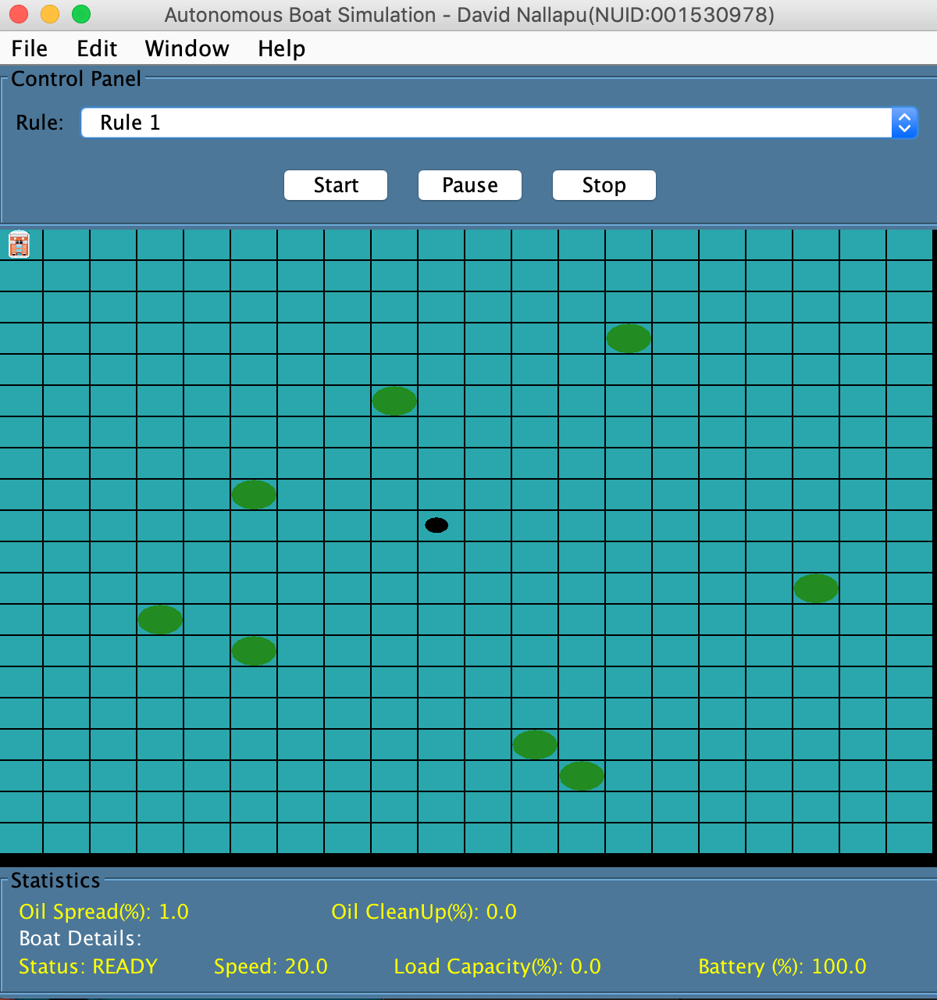
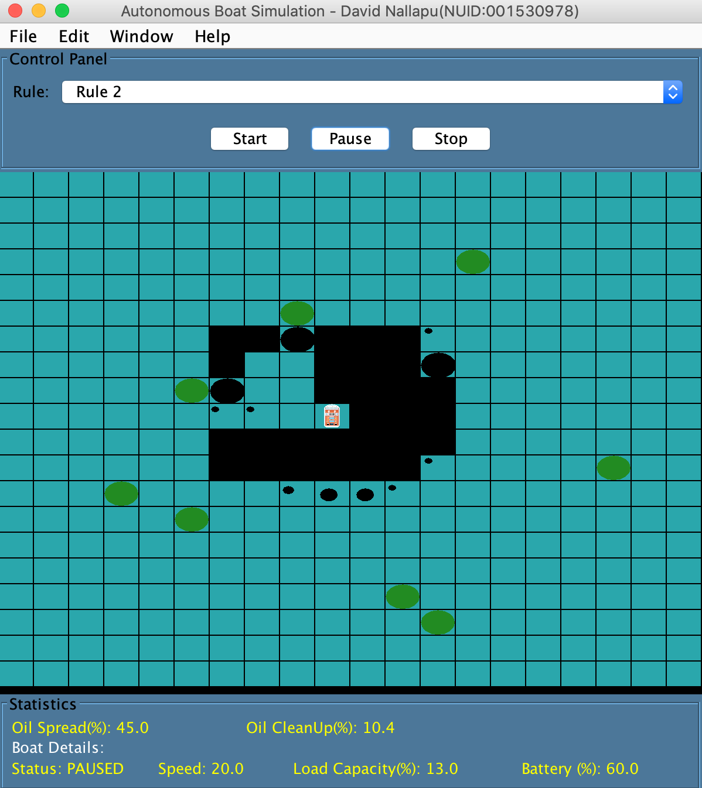
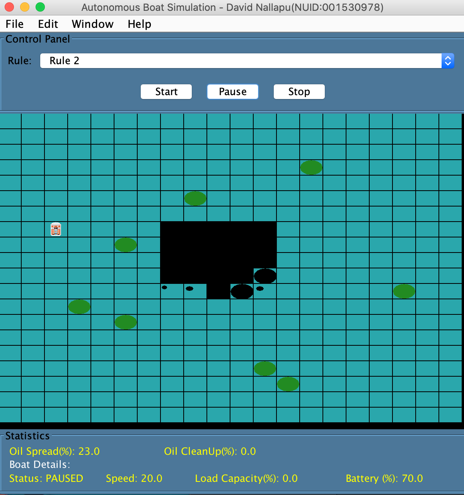

# BoatOilCleanUpSimulation
 Multithreaded GUI of an Autonomous Boat cleaning up Oil Spill.

[![LinkedIn][linkedin-shield]][linkedin-url]

 

  

  <h3 align="center">Autonomous Boat Simulation</h3>

  

    Multithreaded GUI of an Autonomous Boat cleaning up Oil Spill. Boat and the Oil Spill are multithreaded. Oil Spill Algirthm goes in a clockwise manner. <ul<Functionalities include :</ul>
<li>Start/Stop</li> 
<li>3 Boat Movement Rules</li> 
<li>Refuel and Unload of Boat </li> 
<li>Statistics Panel</li> 
     
  

<!-- TABLE OF CONTENTS -->
## Table of Contents

* [About the Project](#about-the-project)
* [Getting Started](#getting-started)
* [Usage](#usage)
* [Contact](#contact)

<!-- ABOUT THE PROJECT -->
## About The Project

[![Product Name Screen Shot][product-screenshot]](https://example.com)

Here's a blank template to get started:
**To avoid retyping too much info. Do a search and replace with your text editor for the following:**
`github_username`, `repo`, `twitter_handle`, `email`

<!-- GETTING STARTED -->
## Getting Started

To get a local copy up and running, download the ABoat.jar file. Java JDK must be installed. 

<!-- USAGE EXAMPLES -->
## Usage

Use this space to show useful examples of how a project can be used. Additional screenshots, code examples and demos work well in this space. You may also link to more resources.

Boat starts from the left corner while the oil starts spilling from the center of the grid.

Boat cleans up the oil in each grid.

Boat refuels when the Load Capacity or Battery Capacity have exhausted. This can be seen in the statisitics panel.

Contributions are what make the open source community such an amazing place to be learn, inspire, and create. Any contributions you make are **greatly appreciated**.

1. Fork the Project
2. Create your Feature Branch (`git checkout -b feature/AmazingFeature`)
3. Commit your Changes (`git commit -m 'Add some AmazingFeature'`)
4. Push to the Branch (`git push origin feature/AmazingFeature`)
5. Open a Pull Request

<!-- CONTACT -->
## Contact

davidsam1998@gmail.com - email
[linkedin-shield]: https://img.shields.io/badge/-LinkedIn-black.svg?style=flat-square&logo=linkedin&colorB=555
[linkedin-url]: https://linkedin.com/in/davidsnallapu
[product-screenshot]: Images/1.png
